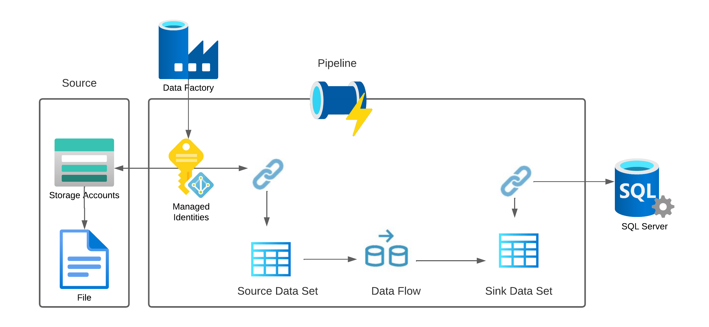

# Data Engineering Project with Bicep and Azure Data Factory

## Overview

This repository contains the Bicep code and associated files for a data engineering project focused on data ingestion and transformation using Azure Data Factory (ADF). The goal of this project is to create an ETL flow that consolidates data from various sources, such as banks, employees, and claims, into a unified table in a SQL Server database.

## Table of Contents

- [Introduction](#data-engineering-project-with-bicep-and-azure-data-factory)
- [Project Overview](#overview)
- [Getting Started](#getting-started)
  - [Prerequisites](#prerequisites)
  - [Setting up Azure Resources](#setting-up-azure-resources)
  - [Deploying the Bicep Code](#deploying-the-bicep-code)
- [Project Structure](#project-structure)
- [Data Flow](#data-flow)
- [Data Sources](data/)
- [Troubleshooting](#troubleshooting)
- [Contributing](#contributing)
- [License](#license)

## Getting Started

### Prerequisites

- An Azure subscription.
- Azure CLI installed on your machine for deploying the Bicep code.

### Setting up Azure Resources

The Bicep code creates the following Azure resources:

1. Azure Data Factory: Create an Azure Data Factory instance that will be used to define and manage the ETL flow.

2. Storage Account: Set up a storage account to store the data sources like CSV files or any other data files needed for the project.

3. SQL Server and Database: Create an Azure SQL Server and a database where the unified table will be created as the data output.

### Deploying the Bicep Code

1. Clone this repository to your local machine.
2. Modify the `configuration/config.bicepparam` file to define your data factory, data pipelines, datasets, and other necessary resources.
3. Open a terminal and navigate to the project directory.
4. Authenticate with your Azure account using `az login`.
5. Deploy the Bicep code to Azure using the Azure CLI or the shell script: `scripts/deploy.sh`.
